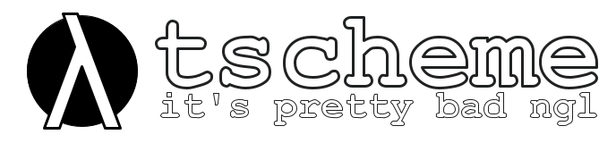

**tscheme** is an (in-progress) Scheme interpreter written in Python,
undertaken as an exercise in programming.

### Components:
- **Lexer** (`lexer.py`) - Tested working, pretty much done
  except some minor error handling things
- **Parser** (`parser.py`) - Tested working, could use some
  additional work to avoid stack overflows with very nested 
  expressions
- **Interpreter** (`interpreter.py`) - Sketchy at best, the
  evaluation function is pretty good but scoping and envs
  need some work.

### To-do
- [X] Tokenizer
- [X] Recursive Decent Parser
- [X] Basic math parsing in interpreter (Lispy Calculator)
- [X] Get basic function calls working in `interpreter.py`
- [ ] Write some documentation
- [ ] Tail call optimisation
- [ ] New parsing algorithm (?)

### References:
- Interpreter portion inspired by Peter Norvig's excellent [*How To Build a Lisp 
  Interpreter in Python*](http://norvig.com/lispy.html)
- Many thanks to [Crafting Interpreters](https://craftinginterpreters.net)
  for inspiring this whole rabbit hole